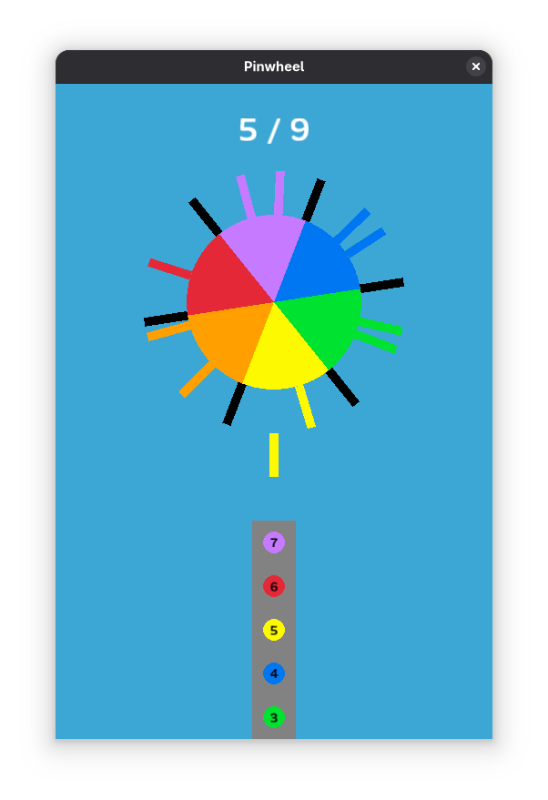

# Pinwheel

A little game about firing pins at a spinning circle. Clone of a game I saw on the at-table
point-of-sale system at an Applebee's. Uses [`macroquad`][macroquad]. Play online [here][play] or
see below for build steps. Space/tap/click to fire pins and restart/advance levels.

[macroquad]: https://macroquad.rs/
[play]: https://bradleygannon.com/blog/2025/pinwheel-game-part-two/play/

For more information, see blog posts [here][blog part one] and [here][blog part two].

[blog part one]: https://bradleygannon.com/blog/2025/pinwheel-game-part-one/
[blog part two]: https://bradleygannon.com/blog/2025/pinwheel-game-part-two/

## Build Steps

1. Install [Rust][install rust].
2. Install native dependencies. See [here][macroquad deps] or run `nix-shell`.
3. `cargo run --release`

[install rust]: https://rustup.rs/
[macroquad deps]: https://github.com/not-fl3/macroquad#linux